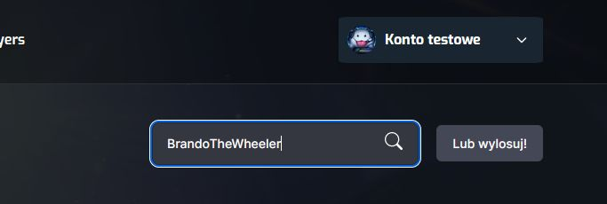
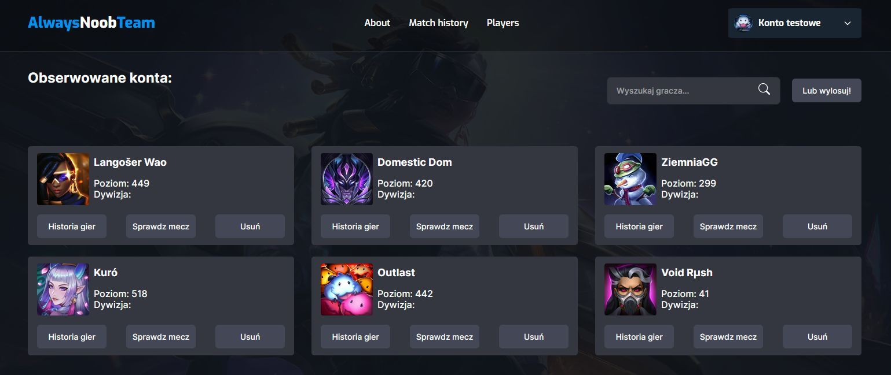
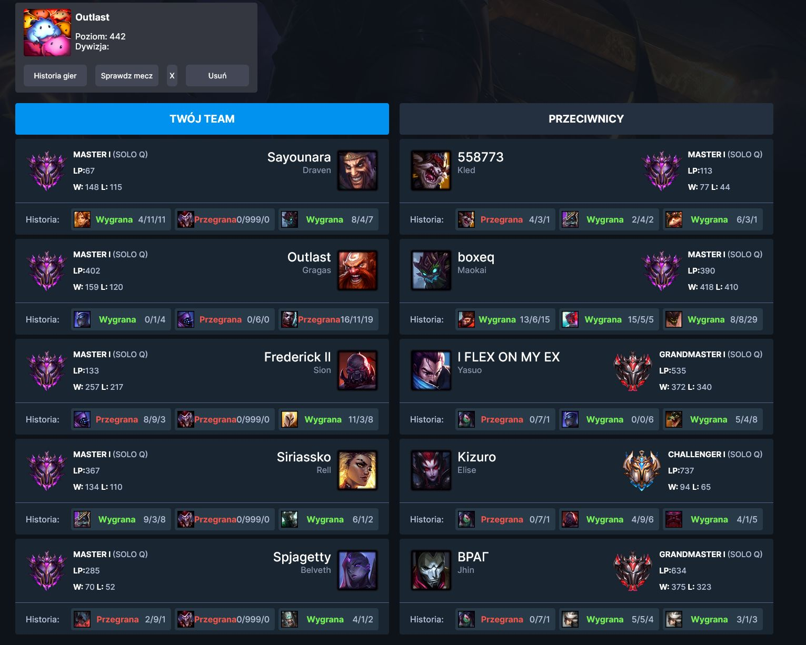

# Always NOOB_TEAM!

League of legends to zręcznościowa zespołowa gra, oparta w dużej mierze na zasadach "Papier, kamień, nożyce".
Nie daj się jednak zwieść jej zręcznościowemu charakterowi. Kluczem do zwycięstaw jest taktyka,
dobranie z pośród ponad 100 postaci i kilkuset przedmiotów, takiego zestawu, który pokona przeciwników.

Dzięki aplikacji "Always NOOB_TEAM" możesz zobaczyć:

1. W jakiej dywizji znajdują się poszczególni przeciwnicy (a także sojusznicy).
2. Ile punktów w obecnej lidze.
3. Jaki stosunek zwycięstw do przegranych.

Są to podstawowe dane, ale kluczowe elementy pomagające podjąć odpowiednie, strategiczne decyzje prowadzące do zwycięstwa.

Już niedługo dokłądniejsze dane.

Strona dostępna pod adresem:

http://noobteam.kolodziejdev.pl/

# Techniczna część:

Aby obserwować przywoływaczy, najlepiej założyć własne konto, ale możesz na razie użyć konta testowego:


Wpisz imię swojego przywoływacza, lub kolegi (na razie tylko EU-NE), lub wylosuj jakiegoś z grających aktualnie graczy.



Dodaj go do listy obserwowanych graczy.


Sprawdz z kim grasz



Na Twoim miejscu, zgankował bym Rengara lub Shyvanę... a od reszty, trzymał bym się z daleka:



### Instalacja:

```dotenv
npm install
```

.env:

```dotenv
REACT_APP_BACKEND=https://megak-nt.herokuapp.com
REACT_APP_DDRAGON=12.16.1
```

lub jeśli posiadasz backend:
- [@backend](https://github.com/BrandoSoft/noobteam_back)


```dotenv

REACT_APP_BACKEND=http://localhost:3001
REACT_APP_DDRAGON=12.16.1
```


**Tech Stack**

**Client:** React, Redux, SCSS

**Server:** Express, Typescript


### Roadmap

- Zrobić readme z prawdziwego zdarzenia.
- dodac masę funkcjonalności (na razie klucz api który mam, nie pozwala na więcej niż 20 requestów/sec), a to za mało by dokonać analizy przeciwników.
- refactor apki, na przykład przeniesienie wszystkich apiCalls do osobnego pliku.
- 
### Known problems:
- cors works for someones, someones are blocked...
- avatars sometimes didnt works...
